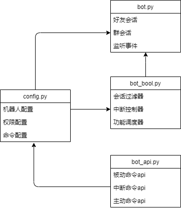

# **Bot_momo**

**bot_momo** 是一个便捷拓展功能的QQ机器人框架，基于 **[Graia Application](https://github.com/GraiaProject/Application)**

## 开始使用

### 基础环境

* [`python`](https://www.python.org/) >= [3.8](https://www.python.org/)
* `graia-application-mirai` == [0.19.0](https://github.com/GraiaProject/Application)
* `mirai-console-loader` >= [1.0.5](https://github.com/iTXTech/mirai-console-loader/releases)
* `mirai-api-http` == [1.x](https://github.com/project-mirai/mirai-api-http/releases)

---

注：`java` 请使用 `openjdk`,其它请根据传送门进行配置

### 安装

```
git clone https://github.com/luxuncang/Bot_momo.git
```

### 文件配置



我们只需要专注 `config.py` 和 `bot_api.py`

**config.py**

```python
## 机器人配置
bot_session = {
    'host': "http://127.0.0.1:8000",# 填入 mirai-console-loader 运行地址
    'authKey': , # 填入 authKey
    'account': , # 你的机器人的 qq 号
    'websocket': True 
}

## 权限配置
'''
all 默认拥有所有权限
权限配置(机器人响应的范围) 默认根据类别划分
可添加自定义类别,member优先级高于group
即只要member有权限就可触发命令
无论group是否有权限
'''
bot_api.authority = {
    'group':{
        'all':[], 
        'base':[],# 填写群ID
    },
    'member':{
        'all':[],
        'base':[],# 填写好友ID
    },
    'shield':[], # 屏蔽对象 `ID`

    'authlist':{
        'base':[] # 填写该类别 `command`
    } 
}
```

**bot_api.py**

```python
'''
bot_api 自定义功能的主要文件

主动命令格式：
@Resolutionmessage()
def bot_api(text):
    ...
    return res

中断命令格式：
@Resolutionmessage()
def bot_api(text):
    ...
    return (text[1],res,text[0])

@Resolutionmessage()
def i_bot_api(text):
    ...
    return ('',res)

自定义任务格式：
def bot_api():
    ...
    return res

ps: 如果注释带有 `key` 请填写key 否则不能直接使用
'''
```

### 文档

参见源码

### 鸣谢&相关项目

特别感谢 `mamoe` 和 [`GreyElaina`](https://github.com/mamoe) 给我们带来这些精彩的项目:

* [`mirai`](https://github.com/mamoe/mirai): 即 `mirai-core`, 一个高性能, 高可扩展性的 QQ 协议库
* [`mirai-console`](https://github.com/mamoe/mirai-console): 一个基于 `mirai` 开发的插件式可扩展开发平台
* [`mirai-api-http`](https://github.com/project-mirai/mirai-api-http):  `mirai` 交互方式的 `mirai-console` 插件
* `Graia Application` : 一个设计精巧, 协议实现完备的, 即时聊天软件自动化框架

也感谢所有基于本项目开发的各位开发者, 请积极向上游项目反馈问题.

### 许可证

我们使用 [`GNU AGPLv3`](https://choosealicense.com/licenses/agpl-3.0/) 作为本项目的开源许可证.
